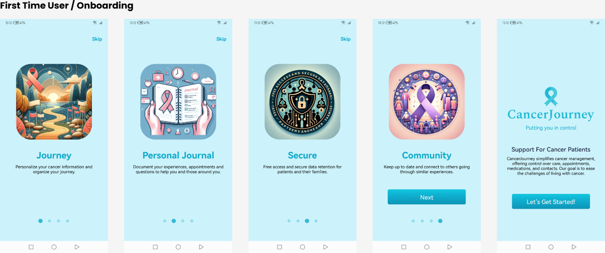
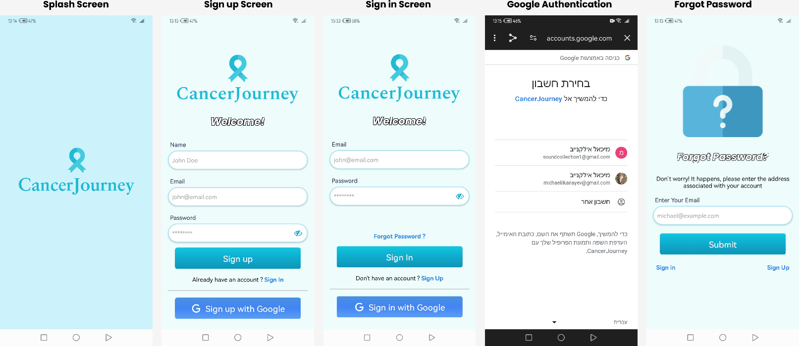
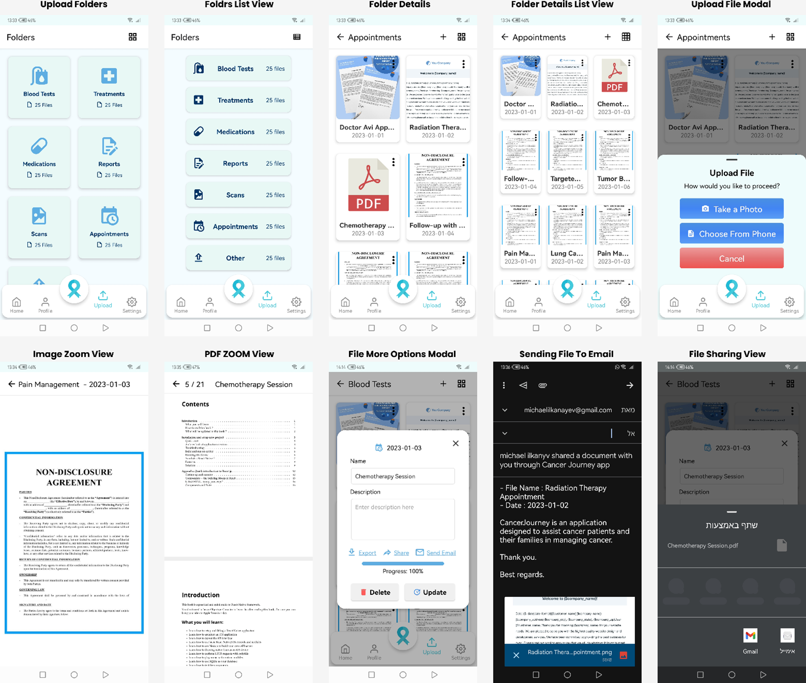
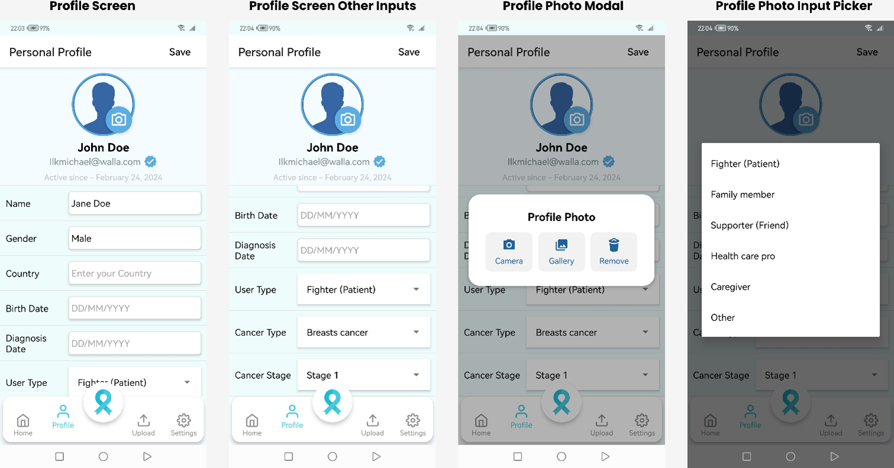
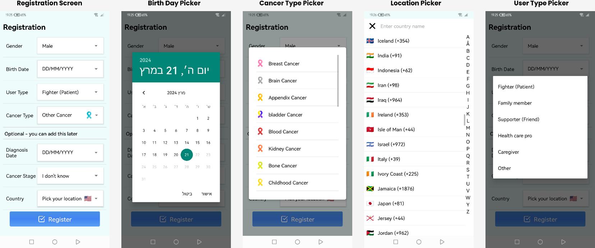
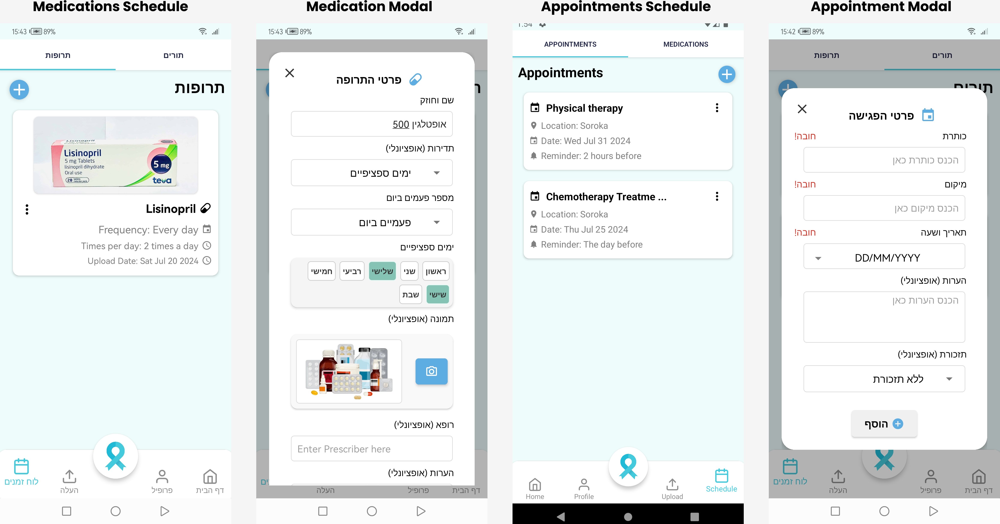
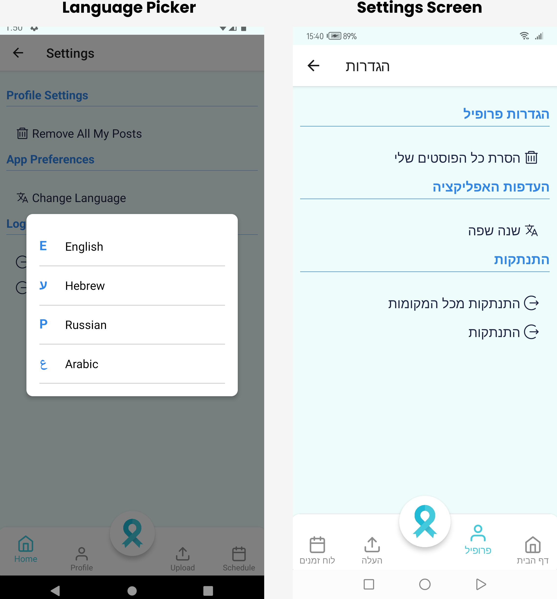
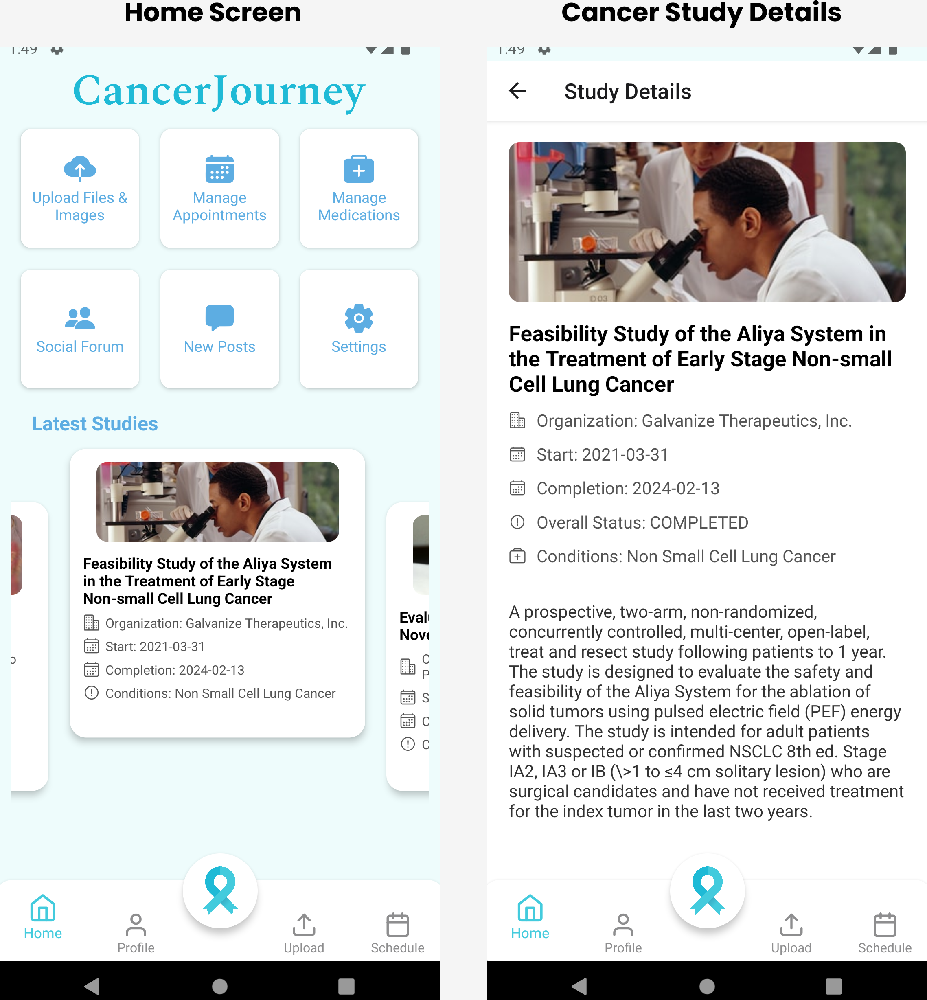

 
 
---

## Description

**Everyone’s cancer journey is different, individual. And with so much information to stay on top of, we know it can also seem overwhelming.**

**CancerJourney is an application designed to assist cancer patients in managing and organizing their treatments in a more convenient and efficient manner. By providing timely alerts, helping patients stay organized with medical appointments, and offering resources for emotional support, this app aims to simplify complex treatment schedules and facilitate communication with healthcare professionals.**

**We understand that every cancer journey is unique, and that there is a lot of information to stay on top of, which can be overwhelming. CancerJourney has been created to help patients stay in control of their care, appointments, medications, and contacts, with relevant, expert information specific to their cancer. Our mission is to make living with cancer a little bit easier.**

**If you are living with cancer, we are here to support you. CancerJourney aims to be a useful resource for patients, providing the help they need to manage their condition and improve their quality of life. Help is always on hand with CancerJourney.**

## Technologies Used and Features

| Technologies Used  | Features                        |
| ------------------ | ------------------------------- |
| React Native       | Mobile app development          |
| React Redux        | State management                |
| Node.js            | Backend server                  |
| Express.js         | Web framework                   |
| MongoDB            | Database                        |
| TypeScript         | Strong typing                   |
| Firebase           | Notifications                   |
| AWS S3             | Media storage                   |
| i18next            | Localization management         |
| React Query        | Data fetching                   |
| Mailtrap           | Email testing                   |
| Unsplash API       | Image resources                 |
| ClinicalTrials API | Studies API Clinical trial data |
| Jest               | Testing                         |
| Aggregation        | Efficient data handling         |

## Features

- **Timely Alerts**: Never miss an appointment or medication dose with our reminder system.
- **Organize Treatments**: Keep track of your treatment plans and schedules in one place.
- **Emotional Support**: Access resources and support to help you cope emotionally.
- **Communication**: Easily communicate with your healthcare professionals.
- **Expert Information**: Get information specific to your type of cancer.

## Video Showcase

## App Screenshots

  

  

